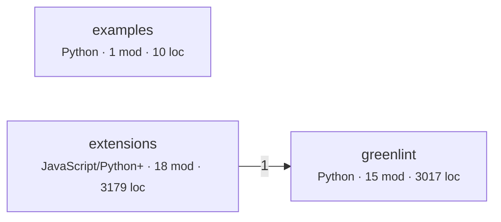
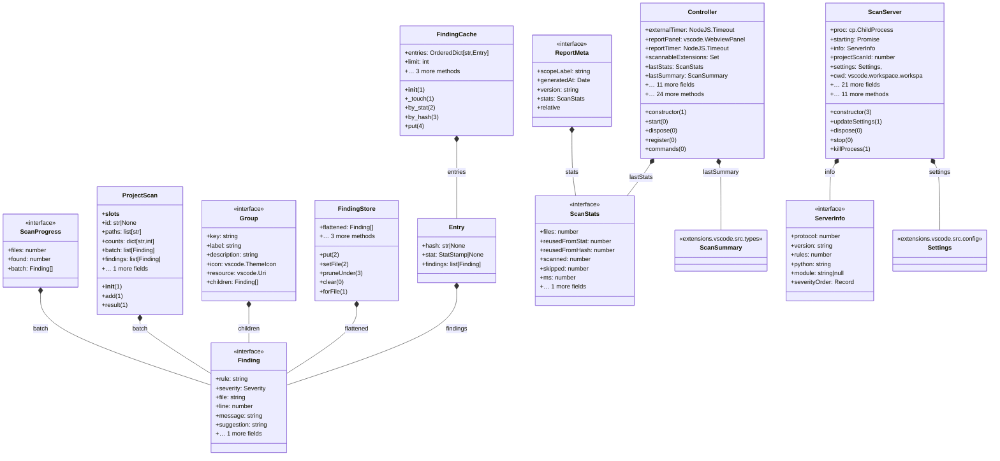
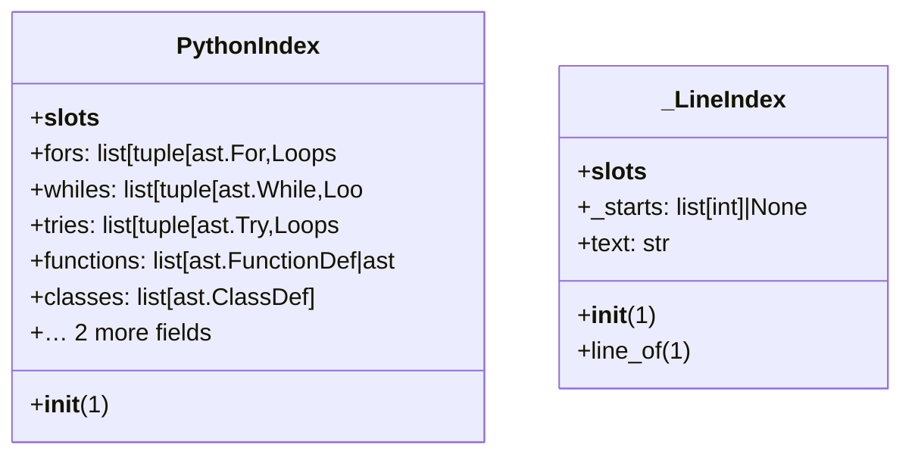

# Architecture map

Derived from source by automap 2.0. Every line is computed, not written. Regenerate with `automap map`; do not edit by hand.

## What this says about the system

Each item fired because a measurement crossed a threshold. The numbers and the evidence are from your code; the explanation is fixed text from a rule catalog, identical every time that rule fires on any repository. `automap rules` prints the catalog on its own so you can audit the claims before trusting them here. What none of it can tell you is why your team built it this way — that is what `automap adr` leaves blank.

| | count |
|---|---:|
| Worth attention | 1 |
| Minor | 1 |
| Notes | 1 |

### Worth attention · 2 module(s) are more than 4× the median size (142 lines); the largest is 764 lines.

**Why it matters.** A file this far from the median is rarely one idea. It cannot be reviewed in one sitting, it produces merge conflicts between people working on unrelated things, and it hides its internal structure from every tool that works at file granularity — including this one, which sees it as a single node.

**What usually causes it.** Accretion. Each addition was small and reasonable, and no single commit was the one that made it too large.

**What to do.** Split along the lines its own imports suggest: the groups of functions that share dependencies are usually the natural modules. Do it before it becomes the file everyone avoids.

<details><summary>Evidence</summary>

- `greenlint/rules.py` — 764 lines
- `extensions/vscode/src/extension.ts` — 735 lines

</details>

<sub>`ARCH-GODFILE` · Size and shape</sub>

### Minor · 6 modules over 30 lines are imported by nothing in this tree.

**Why it matters.** Unreferenced code still gets read, still gets updated during refactors, and still appears in searches. If it is genuinely unused it is a tax on every future reader. If it is used through a mechanism no static tool can see, that mechanism is exactly the thing worth writing down, because nobody will infer it.

**What usually causes it.** Entry points invoked by a runner or framework, plugins loaded by name, code kept 'just in case', or genuine leftovers.

**What to do.** Check each against how it is actually invoked. Delete what is dead; for the rest, record the invocation mechanism where a reader will find it.

<details><summary>Evidence</summary>

- `extensions/vscode/esbuild.mjs` — 31 lines
- `extensions/vscode/server/greenlint_api.py` — 92 lines
- `extensions/vscode/server/greenlint_server.py` — 425 lines
- `extensions/vscode/server/scan_cache.py` — 208 lines
- `extensions/vscode/server/server_ops.py` — 119 lines
- `extensions/vscode/src/extension.ts` — 735 lines

</details>

<sub>`ARCH-ORPHAN` · Size and shape</sub>

### Note · No layering declared, so layer checks are off.

**Why it matters.** Cycles and coupling are measurable without knowing your intent, but 'this dependency should not exist' is not. Declaring layers is how you tell the tool what the design is supposed to be, which turns a description into a check that can fail in CI.

**What usually causes it.** Most repositories never write the layering down; it lives in review comments and in whoever has been there longest.

**What to do.** Add a `layers` map to `.automap.json`, ordered top to bottom. Start with the layering you believe you have — the first run will tell you whether you have it.

<sub>`ARCH-NOLAYERS` · Evidence quality</sub>

## Inside the files

The section above reasons about the import graph, where an edge either exists or does not. This one reads inside files, and its evidence is weaker by construction. Python is analysed with its real grammar, so complexity, nesting, length and parameter counts are exact. Every other language is matched lexically against comment-stripped source: those rules report **the presence of a construct, not a proven defect**. There is no dataflow analysis here. A flagged line may be perfectly correct in context, and an unflagged file may still be wrong. Read these as places to look, not as a verdict.

| category | findings |
|---|---:|
| Security | 4 |
| Performance | 3 |
| Algorithms and data structures | 2 |
| Maintainability | 1 |
| Readability | 1 |

### Security

**Serious · SEC-EVAL** — 2 occurrence(s) across 2 file(s).

*Why it matters.* Evaluating a string as code means the set of things this program can do is not fixed at build time. If any part of that string is influenced by input, the answer is 'anything the process can do'. It also defeats every other tool in the pipeline: type checkers, linters, and this one cannot see through it.

*What usually causes it.* Usually dynamic dispatch, config-driven behaviour, or deserialising something convenient. Almost always reachable another way.

*What to do.* Replace with an explicit dispatch table mapping allowed names to functions. If the input really is arbitrary code, isolate it in a sandboxed process with its own privileges.

<details><summary>Evidence</summary>

- `extensions/vscode/src/excludes.ts:45` — `exec(`
- `extensions/vscode/src/interpreters.ts:105` — `exec(`

</details>

**Serious · SEC-SHELL** — 65 occurrence(s) across 8 file(s).

*Why it matters.* Handing a string to a shell means the shell parses it: quoting, globbing, pipes, and semicolons all apply. Any input that reaches that string can add another command. This is command injection, and it is one of the oldest and most reliably exploited defects there is.

*What usually causes it.* Building a command line by concatenation because it is the shortest way to call an external tool.

*What to do.* Pass an argument list rather than a string, and do not involve a shell: `subprocess.run([...], shell=False)`, `execFile`, `ProcessBuilder`. If a shell feature is genuinely needed, validate against an allowlist first.

<details><summary>Evidence</summary>

- `extensions/vscode/src/diagnostics.ts:38` — ``${finding.rule} ${`
- `extensions/vscode/src/diagnostics.ts:77` — ``${SEVERITY_ICON[finding.severity]} **${`
- `extensions/vscode/src/diagnostics.ts:78` — ``[${finding.rule}](${ruleDocsUrl(finding)}) · ${`
- `extensions/vscode/src/diagnostics.ts:79` — ``**Do instead:** ${`
- `extensions/vscode/src/diagnostics.ts:80` — ``\n**Rough cost:** ${`
- `extensions/vscode/src/engine.ts:100` — ``[greenlint] looking for greenlint in order: ${`

</details>

**Serious · SEC-SQLCONCAT** — 1 occurrence(s) across 1 file(s).

*Why it matters.* A query assembled by concatenation cannot distinguish the query's structure from its data, so any input that reaches it can change what the query does. Escaping by hand is not a fix; the parser rules are more complicated than the escaping usually accounts for.

*What usually causes it.* A query that started static and gained one dynamic value, most often an ORDER BY or an IN clause that parameter binding makes awkward.

*What to do.* Use parameter binding for values. Where the dynamic part is an identifier or a sort direction, validate it against an explicit allowlist, since binding cannot parameterise those.

<details><summary>Evidence</summary>

- `greenlint/rules.py:99` — `SELECT\s+\*\s+FROM`

</details>

**Worth attention · SEC-WEAKCRYPTO** — 1 occurrence(s) across 1 file(s).

*Why it matters.* MD5 and SHA-1 have practical collision attacks, DES has an exhaustible key space, and ECB mode leaks structure because identical plaintext blocks produce identical ciphertext. Each is fine for a checksum and wrong for anything where an adversary benefits from forging or reading.

*What usually causes it.* Copied from an older example, or chosen when the use was non-security and later became security-relevant.

*What to do.* For integrity use SHA-256 or better; for passwords use argon2, scrypt, or bcrypt, never a plain hash; for encryption use AES-GCM or a library that picks the mode for you. Where the use is genuinely a non-security checksum, say so in a comment so the next reader does not have to re-derive it.

<details><summary>Evidence</summary>

- `greenlint/baselines.py:55` — `sha1(`

</details>

### Performance

**Worth attention · PERF-SYNCIO** — 5 occurrence(s) across 1 file(s).

*Why it matters.* Synchronous I/O blocks the event loop, which in a single-threaded runtime means every other request waits, not just this one. Throughput collapses under concurrency even though each individual operation looks fast.

*What usually causes it.* Startup and CLI code where blocking is fine, later reused inside a request path where it is not.

*What to do.* Use the promise-based forms and await them. Where the call really is startup-only, keep it out of any module that a request path imports so it cannot be reused by accident.

<details><summary>Evidence</summary>

- `extensions/vscode/src/interpreters.ts:80` — `existsSync(`
- `extensions/vscode/src/interpreters.ts:81` — `existsSync(`
- `extensions/vscode/src/interpreters.ts:106` — `readFileSync(`
- `extensions/vscode/src/interpreters.ts:123` — `existsSync(`
- `extensions/vscode/src/interpreters.ts:139` — `existsSync(`

</details>

**Worth attention · PERF-NESTEDLOOP** — 2 occurrence(s) across 2 file(s).

*Why it matters.* Three levels of loop nesting means work proportional to the product of three collection sizes. That is fine when the inner collections are bounded and quietly catastrophic when one of them grows with data.

*What usually causes it.* An inner lookup written as a scan because the collection was small when the code was written.

*What to do.* Check what each level iterates over and which of them can grow. The usual fix is to replace the innermost scan with a dictionary or set built once outside the loops.

<details><summary>Evidence</summary>

- `extensions/vscode/src/excludes.ts:22` — `4 levels of loop nesting`
- `greenlint/astindex.py:130` — `3 levels of loop nesting`

</details>

**Minor · PERF-SELECTSTAR** — 3 occurrence(s) across 2 file(s).

*Why it matters.* Selecting every column transfers and deserialises data the caller does not use, prevents the database from answering from an index alone, and couples the code to column order and to columns that have not been added yet.

*What usually causes it.* Convenience during development, or a query that genuinely needed most columns at the time it was written.

*What to do.* Name the columns actually used. It is also the cheapest way to make the query's real dependencies visible to whoever changes the schema next.

<details><summary>Evidence</summary>

- `examples/basic/sample.py:10` — `SELECT * FROM`
- `greenlint/comments.py:313` — `SELECT * FROM`
- `greenlint/comments.py:341` — `SELECT * FROM`

</details>

### Algorithms and data structures

**Worth attention · ALGO-LINEARSCAN** — 3 occurrence(s) across 2 file(s).

*Why it matters.* Membership testing against a list or array is a linear scan. Inside a loop that makes the whole operation quadratic, which is the most common accidental O(n²) in ordinary application code: no algorithm was chosen, a data structure was.

*What usually causes it.* A list was the obvious container when the code was written, and membership testing was added later without revisiting the choice.

*What to do.* Build a set or dictionary once before the loop and test against that. Membership goes from linear to constant, and the change is usually one line.

<details><summary>Evidence</summary>

- `extensions/vscode/esbuild.mjs:11` — `.includes(`
- `extensions/vscode/src/protocol.ts:75` — `.indexOf(`
- `extensions/vscode/src/protocol.ts:83` — `.indexOf(`

</details>

**Worth attention · ALGO-SORTLOOP** — 1 occurrence(s) across 1 file(s).

*Why it matters.* Sorting inside a loop repeats an n log n operation on data that has usually not changed, or has changed in a way that could be maintained incrementally. The total cost is a factor of n above what the work requires.

*What usually causes it.* Needing ordered data at a point inside the loop, with the sort placed where the need appears rather than where the data is produced.

*What to do.* Sort once before the loop. If the collection genuinely changes each iteration, a heap or a sorted container maintains order at log n per insertion instead of n log n per pass.

<details><summary>Evidence</summary>

- `greenlint/cli.py:73` — `sorted(`

</details>

### Maintainability

**Worth attention · MNT-SWALLOW** — 1 occurrence(s) across 1 file(s).

*Why it matters.* An empty handler converts a failure into a silent wrong answer. The program continues in a state its author did not anticipate, and the eventual symptom appears somewhere unrelated with no trace of the original cause. Debugging time for these is measured in days.

*What usually causes it.* A failure that was noisy and not understood, silenced to get on with the work, and never revisited.

*What to do.* Handle it, or log it with enough context to identify the case, or let it propagate. If it is genuinely expected and safe, catch the specific exception type and write a comment saying why nothing needs to happen.

<details><summary>Evidence</summary>

- `extensions/vscode/src/interpreters.ts:113` — `catch {`

</details>

### Readability

**Worth attention · RDB-NESTING** — 2 of 135 Python functions (1%) nest control flow 4 levels or deeper.

*Why it matters.* Each level of nesting is a condition the reader must keep true in their head for everything inside it. Depth compounds: at four levels the reader is tracking four simultaneous invariants to understand one line. Nesting correlates with defects more strongly than length does.

*What usually causes it.* Conditions added around existing code rather than in front of it, because wrapping is a smaller diff than restructuring.

*What to do.* Invert the conditions and return early, so the exceptional cases leave at the top and the main path stays at one level. Extracting the innermost block into its own function achieves the same and gives the block a name.

<details><summary>Evidence</summary>

- `greenlint/discovery.py:126` — `walk_files`, depth 6
- `greenlint/astindex.py:112` — `index_python`, depth 5

</details>

---

The rest of this document is the evidence those findings were computed from.

## Coverage

What was read, and where every import went. Third-party means the target is expected to live outside this tree. Unaccounted means an import that looks local and resolved to nothing: those are edges missing from the graph below, usually a source root or path alias this tool has not been told about.

| Language | Fidelity | Files | Imports | Internal | Third-party | Unaccounted |
|---|---|---:|---:|---:|---:|---:|
| JavaScript | structural | 1 | 1 | 1 | 0 | 0 |
| Python | parsed | 21 | 235 | 118 | 117 | 0 |
| TypeScript | structural | 12 | 43 | 27 | 16 | 0 |

## Shape

- 34 modules across 3 components
- 114 internal import edges, 1 component couplings
- 6206 lines
- propagation cost 17% — the share of other components an average component can reach through import paths

## Component graph



Dashed edges came from heuristic scanners. Thick borders are in a cycle. Labels count import sites.

## Ways in, and where they lead

This is not a record of what users do. That lives in analytics, and no static tool can recover it: a route nobody has ever called looks exactly like the one every session hits. What follows is the set of journeys the code **permits** — every way in, every navigation edge between screens, and what each way in can reach.

| Kind | Count | Frameworks |
|---|---:|---|
| Event and queue handlers | 3 | queue consumer |

### What each way in reaches

Components a route can touch by following imports, to a depth of four. This is the blast radius of that endpoint, and the set of code a change to it can disturb.

| Entry | Handler | Components reached |
|---|---|---:|
| `ON close` | `extensions/vscode/src/engine.ts:185` | 0  |
| `ON data` | `extensions/vscode/src/engine.ts:147` | 0  |
| `ON error` | `extensions/vscode/src/engine.ts:180` | 0  |

## The nouns

23 types declared: 0 inheritance and 13 composition relationships between types defined in this tree. Relationships to types declared elsewhere are omitted rather than guessed, so this is a lower bound. 7 types were read with a real parser; the rest come from declaration syntax, which is reliable for the declaration and weaker for the member lists.

### `extensions`



### `greenlint`



**Declared but never implemented in this tree:** `Finding`, `Group`, `Pending`, `ReportMeta`, `ScanProgress`, `ScanStats`, `ScanSummary`, `ServerInfo`. Either the implementations live outside this tree, or the abstraction has no second case yet and the indirection is not paying for itself.

## Dependency matrix

Row depends on column; the number is how many import sites hold it. Components are ordered leaves first, so an ordinary dependency points to an earlier column and lands below the diagonal. **Every bold cell above the diagonal is a dependency pointing backwards.** Those cells are the whole review: scan the upper triangle and stop. A matrix is used rather than a drawing because it stays readable at any size.

| # | component | 1 | 2 | 3 |
|---|---|---|---|---|
| 1 | `greenlint` | — | · | · |
| 2 | `extensions` | 1 | — | · |
| 3 | `examples` | · | · | — |

0 cells above the diagonal.

## Reachability from entry points

What each root actually pulls in, to a depth of three. Nothing imports these modules, so they are where a reader has to start.

**greenlint/__main__.py**

```
greenlint.__main__  (Python)
└─ greenlint.cli  (Python)
   ├─ greenlint.base  (Python)
   ├─ greenlint.baselines  (Python)
   │  └─ greenlint.base  (Python)
   ├─ greenlint.config  (Python)
   │  └─ greenlint.base  (Python)
   ├─ greenlint.discovery  (Python)
   │  ├─ greenlint.base  (Python)
   │  ├─ greenlint.baselines  (Python)  ↑ shown above
   │  └─ greenlint.scanning  (Python)
   └─ greenlint.rules  (Python)
      └─ greenlint.base  (Python)
```

**extensions/vscode/src/extension.ts**

```
extensions.vscode.src.extension  (TypeScript)
├─ extensions.vscode.src.config  (TypeScript)
│  └─ extensions.vscode.src.types  (TypeScript)
├─ extensions.vscode.src.diagnostics  (TypeScript)
│  ├─ extensions.vscode.src.config  (TypeScript)  ↑ shown above
│  ├─ extensions.vscode.src.store  (TypeScript)
│  │  └─ extensions.vscode.src.types  (TypeScript)
│  └─ extensions.vscode.src.types  (TypeScript)
├─ extensions.vscode.src.engine  (TypeScript)
│  ├─ extensions.vscode.src.config  (TypeScript)  ↑ shown above
│  ├─ extensions.vscode.src.interpreters  (TypeScript)
│  │  └─ extensions.vscode.src.config  (TypeScript)  ↑ shown above
│  ├─ extensions.vscode.src.protocol  (TypeScript)
│  │  ├─ extensions.vscode.src.share  (TypeScript)
│  │  └─ extensions.vscode.src.types  (TypeScript)
│  ├─ extensions.vscode.src.share  (TypeScript)  ↑ shown above
│  └─ extensions.vscode.src.types  (TypeScript)
├─ extensions.vscode.src.excludes  (TypeScript)
├─ extensions.vscode.src.findingsView  (TypeScript)
│  ├─ extensions.vscode.src.diagnostics  (TypeScript)  ↑ shown above
│  ├─ extensions.vscode.src.store  (TypeScript)  ↑ shown above
│  └─ extensions.vscode.src.types  (TypeScript)
├─ extensions.vscode.src.protocol  (TypeScript)  ↑ shown above
├─ extensions.vscode.src.report  (TypeScript)
│  └─ extensions.vscode.src.types  (TypeScript)
└─ extensions.vscode.src.store  (TypeScript)  ↑ shown above
└─ … 1 more
```

**extensions/vscode/server/greenlint_server.py**

```
extensions.vscode.server.greenlint_server  (Python)
```

## Coupling

| Component | Languages | Modules | LOC | Fan-in | Fan-out | Instability |
|---|---|---:|---:|---:|---:|---:|
| `examples` | Python | 1 | 10 | 0 | 0 | 0.0 |
| `extensions` | JavaScript, Python, TypeScript | 18 | 3179 | 0 | 1 | 1.0 |
| `greenlint` | Python | 15 | 3017 | 1 | 0 | 0.0 |

Instability is fan-out / (fan-in + fan-out). A component many things depend on that itself depends widely propagates change in both directions.

## Cycles

None at component level.

## External dependencies

Third-party packages. Standard-library imports are counted separately below, because a dependency you cannot remove is not a design decision.

| Package | Sites | Components | First site |
|---|---:|---:|---|
| `types_` | 11 | 1 | extensions/vscode/server/greenlint_server.py:65 |
| `server_ops` | 10 | 1 | extensions/vscode/server/greenlint_server.py:53 |
| `vscode` | 9 | 1 | extensions/vscode/src/config.ts:1 |
| `scan_cache` | 5 | 1 | extensions/vscode/server/greenlint_server.py:52 |
| `greenlint_api` | 4 | 1 | extensions/vscode/server/greenlint_server.py:51 |
| `greenlint_server` | 1 | 1 | extensions/vscode/server/server_ops.py:17 |

23 standard-library modules imported; most used: `pathlib` (15), `__future__` (13), `collections` (12), `typing` (12), `re` (6), `path` (5), `sys` (4), `ast` (3), `json` (3), `argparse` (2), `functools` (2), `hashlib` (2).

## Churn against size

Most-changed files in the last 12 months. This is where any map you carry in your head goes stale first.

| File | Lines touched | LOC | Language |
|---|---:|---:|---|
| `extensions/vscode/server/greenlint_server.py` | 1371 | 425 | Python |
| `extensions/vscode/src/engine.ts` | 1081 | 315 | TypeScript |
| `extensions/vscode/src/extension.ts` | 1041 | 735 | TypeScript |
| `greenlint/rules.py` | 764 | 764 | Python |
| `greenlint/comments.py` | 385 | 385 | Python |
| `greenlint/pyrules.py` | 379 | 379 | Python |
| `extensions/vscode/src/findingsView.ts` | 295 | 225 | TypeScript |
| `extensions/vscode/server/scan_cache.py` | 272 | 208 | Python |
| `greenlint/astindex.py` | 234 | 234 | Python |
| `extensions/vscode/src/report.ts` | 222 | 188 | TypeScript |
| `extensions/vscode/src/protocol.ts` | 217 | 183 | TypeScript |
| `greenlint/infra.py` | 213 | 213 | Python |
| `extensions/vscode/src/interpreters.ts` | 197 | 145 | TypeScript |
| `greenlint/discovery.py` | 185 | 185 | Python |
| `greenlint/carbon.py` | 176 | 176 | Python |

## Public surface

<details><summary><code>examples</code> — 2 exported</summary>


`examples.basic.sample`

- def load_users:9
- def poll_forever:4

</details>

<details><summary><code>extensions</code> — 64 exported</summary>


_Showing 40 of 64; `--full` lists them all._


`extensions.vscode.server.greenlint_api`

- const REQUIRED_API:50
- def greenlint_version:78
- def load_greenlint:16
- def missing_api:68

`extensions.vscode.server.greenlint_server`

- class Server:80
- const INTERLEAVE_EVERY:70
- const PROGRESS_INTERVAL_S:72
- def main:399

`extensions.vscode.server.scan_cache`

- class Entry:36
- class FindingCache:46
- class ProjectScan:146
- class RunningSummary:107
- const DEFAULT_CACHE_ENTRIES:16
- def digest:19
- def mtime:26

`extensions.vscode.server.server_ops`

- const DEFAULT_MAX_FILE_BYTES:20
- const PROTOCOL_VERSION:19
- def op_cancel:104
- def op_configure:62
- def op_invalidate:92
- def op_languages:39
- def op_ping:23
- def op_scan_file:54
- def op_scan_text:46
- def op_write_baseline:74

`extensions.vscode.src.config`

- const SEVERITY_LEVELS:19
- function readSettings:27
- function requiresRestart:43
- interface Settings:6
- type RunMode:4

`extensions.vscode.src.diagnostics`

- class GreenlintHoverProvider:83
- const SOURCE:6
- function describe:70
- function toDiagnostics:46

`extensions.vscode.src.engine`

- class ScanServer:17
- const INSTALL_COMMAND:12

`extensions.vscode.src.excludes`

- function editorExcludeGlobs:4
- function expandBraces:41
- function toIgnoreGlobs:55

`extensions.vscode.src.extension`

- function activate:27

</details>

<details><summary><code>greenlint</code> — 44 exported</summary>


_Showing 40 of 44; `--full` lists them all._


`greenlint.astindex`

- class PythonIndex:24
- const SCOPE_BOUNDARIES:157
- def index_python:112

`greenlint.base`

- const BASELINE_FILENAME:21
- const CONFIG_FILENAME:20

`greenlint.baselines`

- const SEVERITY_ORDER:13
- def applicable:25
- def apply_baseline:74
- def finding_sort_key:16
- def fingerprint:32
- def load_baseline:58
- def write_baseline:81

`greenlint.carbon`

- const BUSY_CORE_WATTS:70
- const CO2E_HINTS:90
- const GRID_INTENSITY_G_PER_KWH:69
- const G_CO2E_PER_GB:72
- const KWH_PER_GB_TRANSFERRED:71
- const PAIR:67
- const _HOT_PATH:88
- def core_seconds_per_gram:75

`greenlint.cli`

- def main:110

`greenlint.comments`

- const _NOT_NEWLINE:57
- const _STRING_LANGS:224
- const _STRING_OPEN:250

`greenlint.config`

- def load_config:31

`greenlint.discovery`

- const PRUNED_DIR_NAMES:106
- def is_ignored:54
- def iter_files:158
- def prunable_bases:74
- def scan:178
- def walk_files:126

`greenlint.findings`

- const TEST_FILENAME:15

`greenlint.infra`

- const NEEDS_FULL_HISTORY:125

`greenlint.pyrules`

- const NUMERIC_ONLY_OPS:127
- const PROBE_CALLS:331
- const SCALAR_CALLS:120
- const SCALAR_OPS:122

`greenlint.rules`

- const AST_RULE_IDS:740
- const PATTERN_RULES_BY_LANG:761
- const RULES_BY_ID:737

</details>

---

**Not derivable from code.** Why these boundaries were chosen, what was rejected, and what constraint each one holds. `automap adr` scaffolds one file per decision point with the facts filled in and those questions blank.
